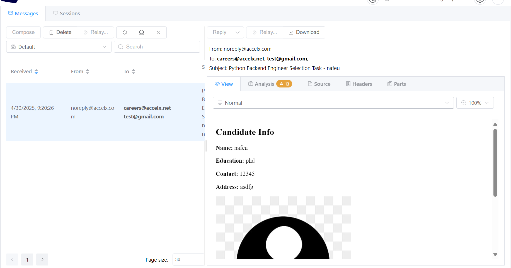

## Multipart Email API with Multiple Recipients & Embedded Image

**Task Description:**  
 A Django REST Framework (DRF) API that sends an HTML email with an embedded image (uploaded as a file) using multiple email service providers. The email must include specific candidate information and be sent to a list of recipients: Gmail, Hotmail, Yahoo.

**Setup Project:**
 - create .env file using 
    ```bash 
    cp .env.example .env
    ```
 - create venv 
    ```bash 
    python -m venv venv
    ```
 - activate venv 
    ```baash 
    source venv/bin/activate
    ```
 - install requirements
    ```bash 
    pip install -r requirements.txt
    ```
- install/use any email server  and give credential in .env . you can use smtpdev server using docker. 
    - install docker and run this command 
    ```bash 
    docker run --rm -it -p 5000:80 -p 2525:25 rnwood/smtp4dev
    ```
 - add your credential for those field taken from .env.example like email data
 - To test : 
 ```bash 
 python manage.py test
 ```
 - Run server : 
    ```bash 
        python manage.py runserver
    ``` 
 - request api using postman. e.g. 
    
 - During Api test To see email visit localhost:5000 . example is below

    
    
**API Specification:**  

- **Endpoint:**  
  `POST /api/send-selection-email/`

- **Request Type:**  
  multipart/form-data

- **Request Payload:**

| Field        | Type           | Required | Description                                  |
|--------------|----------------|----------|----------------------------------------------|
| name         | string         | ✅       | Full name of the candidate                   |
| education    | string         | ✅       | Education info                               |
| contact      | string         | ✅       | Phone number                                 |
| address      | string         | ✅       | Current address                              |
| project_idea | string         | ✅       | Description of a personal project idea       |
| screenshot   | file (jpg/png) | ✅       | GitHub profile screenshot (embedded inline)  |
| recipients   | list[string]   | ✅       | Email addresses (must include allowed domains)|

**Recipient Rules:**  
Allowed recipients must be only from:
- @gmail.com  
- @hotmail.com  
- @yahoo.com  
- careers@accelx.net

**Email Details:**  
- **Subject:** `Python Backend Engineer Selection Task - <Your Name>`
- **HTML Body:** Must include candidate name, education, contact, address, the embedded screenshot displayed in the center, and the project idea below the image with basic styling.

**Example Success Response:**
```
{
  "status": "success",
  "message": "Email sent to 4 recipients"
}
```

**Example Error Response:**
```
{
  "status": "error",
  "message": "Only Gmail, Hotmail, Yahoo are allowed"
}
```

